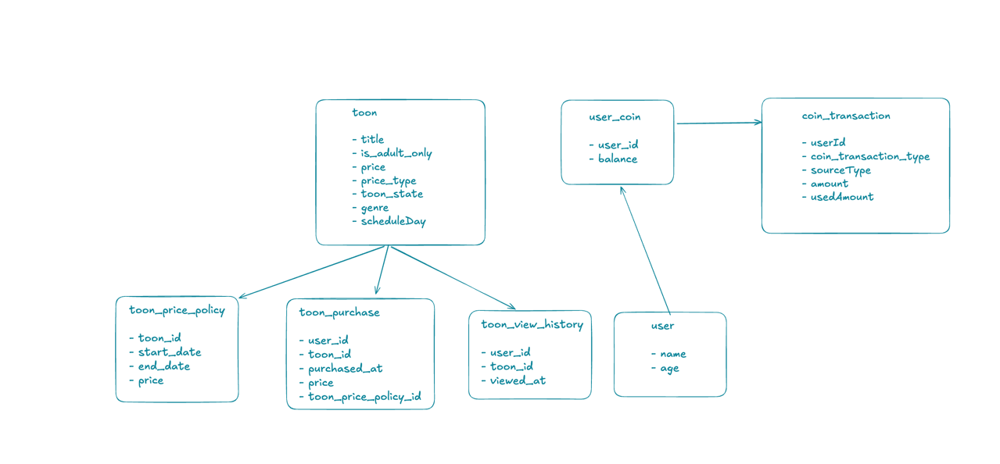

# toon.poc

## 프로젝트 소개
이 프로젝트는 웹툰 서비스를 위한 간단한 백엔드 API 서버입니다. 사용자는 코인으로 웹툰을 구매하고 열람할 수 있는 기능을 제공합니다.

## 기술 스택
- Kotlin 1.9.25
- Spring Boot 3.4.4
- Spring Data JPA
- MySQL
- Redis (인기 작품 캐싱)
- Spring REST Docs
- Docker & Docker Compose

## 시작하기

### 환경 설정
프로젝트 실행을 위해 다음이 필요합니다:
- JDK 21
- Docker & Docker Compose

### 실행 방법

1. 프로젝트 클론
```
git clone https://github.com/your-repo/toon.poc.git
cd toon.poc
```

2. Docker Compose로 필요한 인프라 실행
```
docker-compose up -d
```
이 명령어는 MySQL 데이터베이스와 Redis를 실행합니다.

3. 애플리케이션 빌드 및 실행
```
 ./gradlew bootRun --args='--spring.profiles.active=local --server.port=9001'
```

4. API 문서 접근
애플리케이션 실행 후 아래 URL로 REST Docs 문서에 접근할 수 있습니다:
```
http://localhost:8080/docs/index.html
```

## ERD 



## 주요 기능

### 사용자 인증
- JWT 기반 인증 시스템
- 로그인 기능

## 프로젝트 구조

```
src/
├── main/
│   ├── kotlin/
│   │   └── com/
│   │       └── comics/
│   │           └── lezhin/
│   │               └── toon/
│   │                   └── poc/
│   │                       ├── app/               # 애플리케이션 공통 구성
│   │                       ├── application/       # 서비스 조합 및 트랜잭션 관리 ( 동레이어 간 참조를 방지하기 위해 layer 추가 )
│   │                       ├── common/            # 공통 코드 및 상수
│   │                       ├── controller/        # API 엔드포인트
│   │                       ├── entity/            # 도메인 엔티티
│   │                       ├── repository/        # 데이터 접근 계층
│   │                       └── service/           # 도메인 서비스
│   └── resources/
│       ├── static/
│       │   └── docs/       # 생성된 REST Docs 파일
│       └── application.yml # 애플리케이션 설정
├── test/
└── docs/
    └── asciidoc/           # REST Docs 템플릿
```

### 웹툰 구매 프로세스의 트랜잭션 관리

웹툰 구매는 다음 단계를 포함합니다:

1. 웹툰 가격 확인
2. 사용자 코인 잔액 확인
3. 코인 차감
4. 차감 이력 저장
5. 구매 이력 저장
6. 인기 작품 구매 결과 반영

이 과정에서 고려한 트랜잭션 관리 전략:

1. **비관적 락 사용**:
   - 코인 차감 시 동시성 문제 방지를 위해 비관적 락(Pessimistic Lock) 적용
   - `@Lock(LockModeType.PESSIMISTIC_WRITE)` 사용하여 SELECT FOR UPDATE 구현

2. **데이터 일관성 보장**:
   - 코인 차감과 이력 저장은 단일 트랜잭션으로 묶어 원자성 보장
   - 어느 한 단계라도 실패 시 전체 롤백으로 데이터 일관성 유지

프로젝트에서는 다음과 같이 트랜잭션을 구성했습니다:
```kotlin
// 사용자 작업의 전체 흐름 관리
@ApplicationLayer
class ToonApplication(
    // 의존성 주입
) {
    // 읽기 작업을 포함한 전처리
    @Transactional
    fun purchase(userId: Long, toonId: Long) {
        // 필요한 정보 조회 및 검증
        // ...
        
        // 쓰기 작업 실행
        executePurchaseTransaction(userId, toonId, deductBalance, sourceType)
    }
    
    // 쓰기 작업 (코인 차감 및 이력 저장)
    fun executePurchaseTransaction(
        userId: Long, toonId: Long, deductBalance: Int, sourceType: SourceType
    ) {
        // 코인 차감, 이력 저장 등의 작업
    }
}
```

## 성인 인증 시스템

성인 콘텐츠에 대한 접근 제한을 위해 사용자의 나이(age) 정보를 기반으로 성인 인증 시스템을 구현했습니다.

### 주요 기능

1. **성인 웹툰 필터링**:
   - 웹툰 엔티티에 `isAdultOnly` 플래그를 통해 성인 콘텐츠 표시
   - 사용자 나이가 19세 미만인 경우 성인 콘텐츠 접근 제한

2. **나이 기반 필터링 로직**:
   ```kotlin
   class ToonEntity {
       // 성인 콘텐츠 여부
       @Column(name = "is_adult_only", nullable = false)
       var isAdultOnly: Boolean = false
       
       // 사용자 연령에 따른 필터링 메서드
       fun filter(userEntity: UserEntity) {
           // 성인 전용 콘텐츠이고 사용자가 19세 미만인 경우 예외 발생
           if (this.isAdultOnly && userEntity.age < 19) {
               throw BaseException(ToonCode.ACCESS_DENIED_BY_AGE)
           }
       }
   }
   ```

3. **구매 과정에서의 적용**:
   - 웹툰 구매 전 필터링 로직 실행으로 적절한 접근 보장
   ```kotlin
   @Transactional
   fun purchase(userId: Long, toonId: Long) {
       val userEntity = userReader.getBy(id = userId)
       val toonEntity = toonReader.getToonBy(id = toonId)
       
       // 구매 전 성인 인증 확인
       toonEntity.filter(userEntity = userEntity)
       
       // 구매 로직 진행...
   }
   ```

### 구현 고려사항

- 단순한 나이 기반 검증으로 빠른 접근 제어 가능

## 인기 작품 조회 시스템

인기 작품 조회 기능을 효율적으로 제공하기 위해 Redis를 활용한 캐싱 시스템을 구현했습니다.

### 주요 기능

1. **Redis 키 기반 설계**:
   - 인기 작품 데이터를 효율적으로 저장하고 조회하기 위한 키 설계
   - 키 구조: `viewed:top:adult`, `viewed:top:general`, `viewed:top:combined`
     - 미성년자 인기 작품 조회 시 viewed:top:general <-- Return 
     - 성인이 인기 작품 조회 시 viewed:top:adult + viewed:top:general 의 합인 viewed:top:combined <-- return  

### 구현 고려사항

- Redis의 Sorted Set(ZSet)을 활용하여 인기도(score)에 따른 효율적인 정렬
- 캐시 데이터 만료 처리로 메모리 효율성 확보
